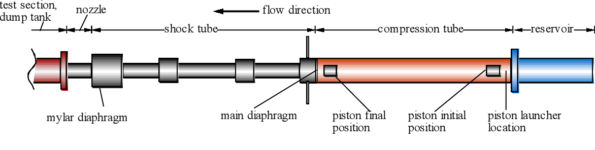

# Automation of T2 Free-Piston Shock Tunnel (Shock-driven wind tunnel)

    <h2 style="font-family: 'Roboto', sans-serif; text-decoration: none;">T2 Shock Tunnel Automation Progress</h2>
    

        

            50%
        

    

## Project Overview

The Hyperview Project aims to develop a fail-safe control system for the T2 Free-Piston Shock Tunnel Facility (T2)at ANU. This system will automate and regulate gas filling using pressure sensors, solenoid valves, and a user interface, ensuring safe operation and preventing failures.
Given that T2 has been inactive for 30 years, this project supports its revitalization for aerospace research. A prototype—the Hyperview Testing Prototype (HTP)—will be built for testing. The system will be scalable, maintainable, and open-source, allowing future enhancements and seamless integration into T2.

## Meet the team

- Armando Castelo <u7231943@anu.edu.au>
- Charl Kruger <u6951533@anu.edu.au>
- Kexiang Wang <u7394240@anu.edu.au>
- Maximilian Parker <u7398910@anu.edu.au>
- Xin Lou <u6803896@anu.edu.au>
- Yingzheng Liu <u7112372@anu.edu.au>

## [Concept of Operations](https://docs.google.com/document/d/e/2PACX-1vRGPuAjrLsx784MuRp6Z50Rg-7hdHrNgCCaArmJ4hUA0zoNK-3MK4YHsUOnW50Ay2KSNTIYVoVEV5WG/pub)

## [Issue Tracker](https://issue-tracker-1d4ed.firebaseapp.com/)

## [Work Break-Down Structure](https://docs.google.com/spreadsheets/d/121keRA4e_B9DwGpZujkCIpi9Lcfe3kRTRIhdFKdyd7o/edit?gid=0#gid=0)

## [Functional Breakdown](https://docs.google.com/document/d/1AttRSd3ZpnZj-HwfrDnpwyIfs05T5YOCBRiZgvpuqZc/edit?tab=t.0)

## Repository Basic Structure
The repository follows a structured hierarchy as follows:
- 1.0 [Project Documents](https://drive.google.com/drive/folders/1EEUJXDYN-YrShFJ8m5IPflVMaD38PGRV) Project management-related files, such as plans, task assignments, and meeting minutes
- 2.0 [Design and Development](https://drive.google.com/drive/folders/13dA1Aj6Z43bpzQEQD2wi8tT5iaUKd82b) - Design and development-related materials, including prototypes, code, and design documents
- 3.0 [Documentation](https://drive.google.com/drive/folders/1-0RIJPpM42lSHHvNO7_Eci5OCwbqimw6) - Key documents, such as requirements analysis, technical documentation, and user manuals
- 4.0 [Resources](https://drive.google.com/drive/folders/1Xr5muFMaWCAu7KEgKbCxemngSl1hqa52) - Related resources, such as reference materials, datasets, and templates
- 5.0 [Communications](https://drive.google.com/drive/folders/1rVEca124F5gI_rSpP8crXuPxaiRhZwka) - Communication records, including emails, discussion logs, and meeting summaries
- 6.0 [Project Closure](https://drive.google.com/drive/folders/102ooc4ERUIvQ4UJuIl1_1tPefp1n1O00) - Project closure-related content, such as final deliverables and closure reports
- 7.0 [Past Version and Discarded Files](https://drive.google.com/drive/folders/1K8-7WGOtuO-DiLu1Gcs81D_IVpaUGQtL) - Archived previous versions and discarded files

## Important Notes
All files should be categorized and stored in the appropriate folders for better organization.
When updating documents, please include version numbers and modification dates.
For any questions, please contact Yingzheng Liu (u7112372@anu.edu.au) or Xind Lou (u6803896@anu.edu.au)

## [Repositories Exploded Structre](https://drive.google.com/drive/folders/1iQv86kc0_cZ6hoyYyBE39-fbijGRcRPB?usp=sharing)
For convenince an expanded view (with link) of the repo's is provided below.

    <a href="https://drive.google.com/drive/folders/1iQv86kc0_cZ6hoyYyBE39-fbijGRcRPB?usp=sharing">ENGN4300 - Hyperview's Repository</a>
<ul>
    <li><a href="https://docs.google.com/document/d/1hCHGRocxe0S2ev2vEF7xBoG97x4UjUpxqV7dzf2FVTA/edit?usp=drivesdk">README</a></li>
<li>1.0 Project Management<ul>  <li>1.1 Project Documents<ul>    <li><a href="https://docs.google.com/spreadsheets/d/1DoLDlf2cv8msjHfw7XKHQoi27ekn5HNeHfPoYCiu6Lc/edit?usp=drivesdk">Decision Log</a></li>
<li><a href="https://docs.google.com/document/d/1B5J7E_MXmqUGW1E5lPnU1Rt51u01Znfv59vZ2n_9y5M/edit?usp=drivesdk">Project Management Plan(PMP)_ver2.0</a></li>
<li>1.1.1 Risk Assessment<ul>      <li><a href="https://docs.google.com/document/d/1Uo40Mghmpx5b6U2Wb4QTAcQ6dFVSgQSa/edit?usp=drivesdk&ouid=114522111113931296621&rtpof=true&sd=true">WHS Hazard and Risk Assessment for Testing “Voltage step down” system.docx</a></li>
  <li><a href="https://docs.google.com/document/d/11qsU1QSzgLUZ2ofzvhxosN-JEOxAmdd1/edit?usp=drivesdk&ouid=114522111113931296621&rtpof=true&sd=true">WHS Hazard and Risk Assessment for Testing “Vacuum Pump & Drive” system.docx</a></li>
  <li><a href="https://docs.google.com/document/d/1BJVbChihesNLE6oxTCK65vd1aAKnFmSs/edit?usp=drivesdk&ouid=114522111113931296621&rtpof=true&sd=true">WHS Hazard and Risk Assessment for Testing "Solenoid" system.docx</a></li>
  <li>Risk Assessment for Project Operation/Technical Aspect<ul>        <li><a href="https://docs.google.com/spreadsheets/d/1hhKzIIcQkVUwMVFiJ6P0BZImEhzJFqPsVsHfVKY5jR8/edit?usp=drivesdk">Risks analysis and tracking for project</a></li>
    <li><a href="https://docs.google.com/spreadsheets/d/1Xu2dSD1uFWx_H7ZMA9SGeshLFMhArU7yZAS-AGAQKks/edit?usp=drivesdk">Risks analysis for specific operation system</a></li>
    <li><a href="https://docs.google.com/document/d/1zzqCqEvN-vAhvuENJPSkq5qXA3CLtkoS/edit?usp=drivesdk&ouid=114522111113931296621&rtpof=true&sd=true">Risk_Management_Form.doc.docx</a></li></ul></li>
  <li>Risk Assessment for Sub-system Testing<ul>        <li><a href="https://docs.google.com/document/d/1_WO1m-JMdXEqg10jFolZHBNR2BEFlrrV/edit?usp=drivesdk&ouid=114522111113931296621&rtpof=true&sd=true">Solenoid Testing Risk Assessment.docx</a></li></ul></li></ul></li>
<li>1.1.2 Timeline and Gantt Chart<ul>      <li><a href="https://docs.google.com/document/d/1qRMrCeSUsLttpX8CqZRDaRGh2-9gVers/edit?usp=drivesdk&ouid=114522111113931296621&rtpof=true&sd=true">Timeline.docx</a></li>
  <li><a href="https://drive.google.com/file/d/17oXZXmoLi_ml37epCyT2acOigJoxGM2J/view?usp=drivesdk">Gantt chart.pdf</a></li>
  <li><a href="https://drive.google.com/file/d/1n5Bqqy0M0lejaQ7qbhipWrsni8caM2bf/view?usp=drivesdk">Gantt chart.mpp</a></li></ul></li></ul></li></ul></li>
<li>2.0 Design and Development<ul>  <li>2.4 Conceptual Design<ul></ul></li>
<li>2.5 Detailed Design<ul>    <li><a href="https://docs.google.com/document/d/1AttRSd3ZpnZj-HwfrDnpwyIfs05T5YOCBRiZgvpuqZc/edit?usp=drivesdk">Functional breakdown</a></li></ul></li>
<li>2.1 Project Initiation<ul>    <li><a href="https://docs.google.com/document/d/1fexxcROwQSZ-jMxOAYUyJ3P4TJYlaPYuo6EW8Nj17Hw/edit?usp=drivesdk">Concept of Operation(version 1.0)</a></li>
<li><a href="https://docs.google.com/document/d/1KxBFku0A-RBEMFJcSXinIp5gtVe8CJ4kdc5aZJNKutM/edit?usp=drivesdk">Concept of Operation(version 2.0)</a></li></ul></li>
<li>2.3 Project Research(Solutions Discovering Phase)<ul>    <li><a href="https://docs.google.com/document/d/1e8Ao25qI_5WhZGZVxjJVyXjPYYTzS1b2dy1Nb8hj0ik/edit?usp=drivesdk">Testing for "Solenoid" system [Stage 1]</a></li>
<li><a href="https://docs.google.com/document/d/1FdBOSbuhoFfJt9v9uIK7WShdz3DtyzhLD9vHYJGxfM8/edit?usp=drivesdk">Testing for “Voltage step down” system [Stage 1]</a></li>
<li><a href="https://docs.google.com/document/d/1f3mhmM4E1EUeRVCrdEu9z9JAiFh71ZMmQM6meXdrAzQ/edit?usp=drivesdk">Odriod + Output Test [Stage 2]</a></li>
<li><a href="https://docs.google.com/document/d/1Y00_CYa7NoT_oCUhcmh_Ovt5RI9AHjiT5Chg0206hM0/edit?usp=drivesdk">Odroid + Input Test [Stage 2]</a></li>
<li><a href="https://docs.google.com/document/d/15PXNh6LXEuD1KS8mea-Zz-OcSmEyG-0tWUeQRLUwqZg/edit?usp=drivesdk">Vacuum Drive Test [Stage 1]</a></li>
<li><a href="https://docs.google.com/document/d/1StOnUvaeFH_mscsLM99eRlTysfqR9-rhmLYNpZDQAls/edit?usp=drivesdk">Full System Functionality Test [Final Test]</a></li></ul></li>
<li>2.2 Project Planning<ul>    <li><a href="https://docs.google.com/document/d/1Pi1xfXld3AEc2-ZpgKhznISLYQOKTuhWwgWCVg-k1Zk/edit?usp=drivesdk">Activities Brainstorm</a></li>
<li><a href="https://docs.google.com/document/d/1RKCEIU7oSXlYRRzg2-5HSl4U7DWZojl7g0cQCAzH_l8/edit?usp=drivesdk">Project Requirements and Responsibility</a></li>
<li><a href="https://docs.google.com/document/d/1qaDv8JH0jJA1aq2l--t7euzHxwvO3ihyQluT5ZP--GU/edit?usp=drivesdk">Link to Miro Board - State Machine</a></li>
<li><a href="https://docs.google.com/document/d/1nQFc2ksuy0ICWgTy5lAYgYARRynQwWQBbD60VIhYolc/edit?usp=drivesdk">Bill of Material(BoM)</a></li>
<li><a href="https://drive.google.com/file/d/1KI6RALfJukUGkzUC1ColW1wmvqi0IwlM/view?usp=drivesdk">Electrics.jpg</a></li>
<li><a href="https://drive.google.com/file/d/1-bprYG90safg_uk7hZVqInxxXQ_MQMoi/view?usp=drivesdk">new GUI.drawio</a></li>
<li><a href="https://docs.google.com/document/d/1VfNqTZeEYkyyZ1Cfs_jyX9o-Ab7el1W7ogwbpho-AiI/edit?usp=drivesdk">System Requirements and Testing Document</a></li>
<li><a href="https://docs.google.com/document/d/1rXG9tGJA2h9YmcGbajjhaxcgr9Ajd_MtkkwWvcGZ1C8/edit?usp=drivesdk">Quality Assurances of Software</a></li>
<li><a href="https://docs.google.com/spreadsheets/d/121keRA4e_B9DwGpZujkCIpi9Lcfe3kRTRIhdFKdyd7o/edit?usp=drivesdk">Work Beakdown Structure</a></li>
<li><a href="https://docs.google.com/document/d/1s_U7odZy1bGcL2BPNM7yVVJHKEkZO238MzzyWXSmG-s/edit?usp=drivesdk">Quality Assurance of Hardware</a></li></ul></li></ul></li>
<li>3.0 Documentation<ul>  <li>3.1 Technical Documents<ul>    <li><a href="https://drive.google.com/file/d/12qawX-7HqQ2FmjvlHYe4rD13MBMGxwYW/view?usp=drivesdk">FillProcedure.pdf</a></li>
<li><a href="https://drive.google.com/file/d/1uzRJsyl9gmWZRouysaHSo7IKntWssRTX/view?usp=drivesdk">Stalker1967.PDF</a></li>
<li><a href="https://docs.google.com/document/d/1KAw5eTHZu2KSsvJorcJ0w2BIgBKIEK3jjPRZzBBoExE/edit?usp=drivesdk">FillProcedure</a></li>
<li><a href="https://drive.google.com/file/d/1J5Ds7it2wzqGJkJGf61drAfwipLgwobL/view?usp=drivesdk">TADFA operation Ver6 S2.pdf</a></li>
<li><a href="https://docs.google.com/presentation/d/1f2T3q5OCO97XLYPWtg1jQrrQ-QiRaQTM/edit?usp=drivesdk&ouid=114522111113931296621&rtpof=true&sd=true">TADFA operation Ver6 S2.ppt</a></li>
<li><a href="https://drive.google.com/file/d/1l15BUDIH_UUrcdguiej6Cx8UZxE7k6g3/view?usp=drivesdk">TADFA operation_ver5.pdf</a></li>
<li><a href="https://docs.google.com/document/d/1HZ7PBsx7Td6dS_7TdliUDFsRvgFXl9NIDGKd97w5O3g/edit?usp=drivesdk">Hardware Specs</a></li>
<li><a href="https://docs.google.com/document/d/1hKGVdXzKWWLuFsEXDyYUQEtdfBN8GoRq5OBO1qx1sHI/edit?usp=drivesdk">Interface list</a></li>
<li><a href="https://drive.google.com/file/d/13JbX7fg5nb9PdnVb0kTn3HaTbf20v8eQ/view?usp=drivesdk">Fill_procedure2.0.gif</a></li>
<li><a href="https://drive.google.com/file/d/1mWate4SHJT_qvd-r3Th-_w0VCP8x8_m1/view?usp=drivesdk">Fill_procedure all.png</a></li>
<li><a href="https://docs.google.com/document/d/1EuGQg-aaHLCEfVlYnbsBi58DWAtcOyx0/edit?usp=drivesdk&ouid=114522111113931296621&rtpof=true&sd=true">NEW Copy of WHS Hazard and Risk Assessment for Testing "Solenoid" system.docx</a></li>
<li><a href="https://docs.google.com/document/d/1B-HAT8kMr47eEEzE68Upr8sDbM-zFZMl/edit?usp=drivesdk&ouid=114522111113931296621&rtpof=true&sd=true">NEW Copy of WHS Hazard and Risk Assessment for Testing “Voltage step down” system.docx</a></li>
<li><a href="https://docs.google.com/document/d/1n2gAqowSpwTFNV5XWiFTi3tASTNx4smd/edit?usp=drivesdk&ouid=114522111113931296621&rtpof=true&sd=true">NEW Copy of WHS Hazard and Risk Assessment for Testing “Vacuum Pump & Drive” system.docx</a></li></ul></li>
<li>3.2 User Manuals<ul>    <li><a href="https://docs.google.com/document/d/1D5ueRBqqHlrk2BrwI8y4dL4BcBvClzomKi-L3oIDtU8/edit?usp=drivesdk">User Manual</a></li></ul></li></ul></li>
<li>4.0 Resources<ul>  <li>4.1 File Templates<ul>    <li><a href="https://drive.google.com/file/d/1_ZotqG8KIPVEIntdQocYxmpisOpl0J1K/view?usp=drivesdk">Weekly Status Report Template.png</a></li>
<li><a href="https://docs.google.com/document/d/1nvu_AkOsaKER2yw4EOJddKCzZqo-gPc5XcIz2xW_ppY/edit?usp=drivesdk">Meeting Minutes Template</a></li>
<li>ANU Templates<ul>      <li><a href="https://drive.google.com/file/d/1DmegN0TzAexU4EODHf1WBI9lElQh7YAg/view?usp=drivesdk">Word-Committee-Minutes Template 2024.dotx</a></li>
  <li><a href="https://drive.google.com/file/d/1PhDYHvDOTdNGblXU2m05-eEWg4fg1kMB/view?usp=drivesdk">Word-Blank-Letterhead 2023.dotx</a></li>
  <li><a href="https://drive.google.com/file/d/1JO1wZXXOIz2VHGrun9DR4PDx8Dw7yIFY/view?usp=drivesdk">ANU_Powerpoint_Light Template 2023.potx</a></li>
  <li><a href="https://drive.google.com/file/d/1J1oYrzoF37WQwnu-A6AHgd6SZNHsZyPV/view?usp=drivesdk">ANU_Powerpoint_Dark Template 2023.potx</a></li>
  <li><a href="https://docs.google.com/document/d/1roffR95jerqMmmeY3gmQJ9kw0Y9oXklB/edit?usp=drivesdk&ouid=114522111113931296621&rtpof=true&sd=true">ANU WHS Hazard and Risk Assessment Template.docx</a></li></ul></li>
<li>Previous Risk Assessment of T2 facility from the Host<ul>      <li><a href="https://docs.google.com/document/d/1Yg97KhVyP6QDU8QXzxPfKU64gQYU3Pj2/edit?usp=drivesdk&ouid=114522111113931296621&rtpof=true&sd=true">Risk Analysis.doc</a></li>
  <li><a href="https://docs.google.com/document/d/1G35e1JXs-66Vt7dyIdCjSAxVI81_HDDB/edit?usp=drivesdk&ouid=114522111113931296621&rtpof=true&sd=true">T2 HS017_Risk_Management_Form.doc</a></li></ul></li></ul></li>
<li>4.3 ANU System Engineering<ul>    <li><a href="https://drive.google.com/file/d/1kc3KOLeWCK1438UVgQZHfWAqwnbR5amg/view?usp=drivesdk">A02_RequirementsMapping.pdf</a></li>
<li><a href="https://drive.google.com/file/d/1cfTzKEd0Ecobk5-M6BfuuLGVIsk1UdgP/view?usp=drivesdk">A03_Metric_Frameworks.pdf</a></li>
<li><a href="https://drive.google.com/file/d/1M165RC6yTPG9LyF27WJ5iL8Gj6mhLiE6/view?usp=drivesdk">A04_Functional_Breakdown.pdf</a></li></ul></li>
<li>4.2 Code Resources<ul></ul></li>
<li>4.4 Reference Documents<ul>    <li><a href="https://drive.google.com/file/d/1t1XXOq4-H2E8eDgQrJvxqXoTUKQl14uT/view?usp=drivesdk">ketowhistle Concept Of Operations v1.1.pdf</a></li>
<li><a href="https://drive.google.com/file/d/1AIy6S2r2DcEnPd9b4RZrdhqsr2TKZsQn/view?usp=drivesdk">ConOps_ProjectVer_2024_V6.pdf</a></li>
<li><a href="https://docs.google.com/document/d/1trFy8yDhFH26hs2ZgJUkXp2J-l4gF9ZxRMRtmS7b4mc/edit?usp=drivesdk">Reference Pictures</a></li>
<li><a href="https://docs.google.com/document/d/1R7NnGUt09i7K-NLl9anz9er1NZLIkhIQK3c6NVI1ev8/edit?usp=drivesdk">work breakdown list</a></li>
<li><a href="https://drive.google.com/file/d/10-T7sjnXEiUyhnQVQjHRL58PCtKH9B7h/view?usp=drivesdk">Reference Safety Sheet.jpg</a></li></ul></li></ul></li>
<li>5.0 Communications<ul>  <li>5.1 Project Audit<ul>    <li>Audit 1<ul>      <li><a href="https://drive.google.com/file/d/1tCvlvSC9d0pZ-go7A3-tArFGz_6w8kpA/view?usp=drivesdk">Hyperview_Audit 1_Presentation.potx</a></li>
  <li><a href="https://docs.google.com/presentation/d/1o332-DBdNWfN8MKekMuCF_E1Qq_njO7P0wMe1m5gH_I/edit?usp=drivesdk">Hyperview_Audit 1_Presentation</a></li>
  <li><a href="https://drive.google.com/file/d/1ybLfmy2Xk_7zgYWFiUFsZ56d-H14QaRz/view?usp=drivesdk">ConOps with Host's Comments.pdf</a></li>
  <li><a href="https://docs.google.com/spreadsheets/d/1eDisrkI9LiXVtiEMfqFzpmXAmHQG_L6stVzzsuRLQs4/edit?usp=drivesdk">Project Audit Feedback Log</a></li></ul></li>
<li>Audit 2<ul>      <li><a href="https://docs.google.com/presentation/d/15ZK0NUTDqmFnS_u4bvVzpyYwwSleDAxl/edit?usp=drivesdk&ouid=114522111113931296621&rtpof=true&sd=true">151024_Hyperview_Project Audit 2.pptx</a></li></ul></li>
<li>Mid-Project Presentation<ul>      <li><a href="https://docs.google.com/presentation/d/1hcmSoT_JCtxNQd7vbQ6aua4qr1Xo2rULnQvSErUWTtE/edit?usp=drivesdk">Mid-Project Presentation</a></li></ul></li>
<li>Audit 3<ul></ul></li>
<li>Audit 4<ul></ul></li>
<li>Poster and Pitch<ul></ul></li></ul></li>
<li>5.2 Meeting Minutes<ul>    <li><a href="https://docs.google.com/document/d/1xk1fioBENHqPZCN84SsiH3FTNyAZ21XA/edit?usp=drivesdk&ouid=114522111113931296621&rtpof=true&sd=true">Meeting 01.docx</a></li>
<li><a href="https://docs.google.com/document/d/13ZRdX1BFRRG9riimSK77iJPgOxFzXZtBSpx_H_4MUMY/edit?usp=drivesdk">Meeting 08</a></li>
<li><a href="https://docs.google.com/document/d/1umVL5HS3qtZq6PBhnhDIoIe0PC3174S7UZyhJbKR43U/edit?usp=drivesdk">Meeting 06</a></li>
<li><a href="https://docs.google.com/document/d/1FFQBYrhzjFoQU7_X3uNytPksYcwBhwKtIHLJPvNJGL4/edit?usp=drivesdk">Meeting 05</a></li>
<li><a href="https://docs.google.com/document/d/1cy-97s2ckTCbz8M5DkbDRi4E_N6izAVi7KgQEUpHevQ/edit?usp=drivesdk">Meeting 04</a></li>
<li><a href="https://docs.google.com/document/d/16z2I4vIAFuarJnJrAedI_ojqfwl_u_rX6Iv9ig5BOys/edit?usp=drivesdk">Meeting 09</a></li>
<li><a href="https://docs.google.com/document/d/17njA9AzPTBx2ggsNUffyR_oFYjGoWV_mmm7AOCU9Q3I/edit?usp=drivesdk">Meeting 03</a></li>
<li><a href="https://docs.google.com/document/d/1OuSagHvfXSSFy4-4zxQAOn-FE0yfP_9D/edit?usp=drivesdk&ouid=114522111113931296621&rtpof=true&sd=true">Meeting 02.docx</a></li>
<li><a href="https://docs.google.com/document/d/164tNkCGfubZwipiL5r37DAnZAOQpA1f8gr0TzJqw4l4/edit?usp=drivesdk">Meeting 07</a></li>
<li><a href="https://docs.google.com/document/d/15Fukh3gK2qvuRr5Ywr5TMQAwTwg8g4oMUUlE7AWfYZM/edit?usp=drivesdk">Meeting 15</a></li>
<li><a href="https://docs.google.com/document/d/12PMPf94RptDTkVbuN9CEgylPHDYQ8NI6h-9H-T3aG0E/edit?usp=drivesdk">Meeting 17</a></li>
<li><a href="https://docs.google.com/document/d/1mOSxKcQufDYHDBfa4yppOfZskrLc5iqWiTsJbYK4I3E/edit?usp=drivesdk">Meeting 14</a></li>
<li><a href="https://docs.google.com/document/d/1Rfk5itSW0QPz-GluMxrX_G7hEyCMl7-_u9H2KgSjFOY/edit?usp=drivesdk">Meeting 13</a></li>
<li><a href="https://docs.google.com/document/d/1SUqbLDZhgpD1kDb-NQ21FnuZp5zzfCtwOjYatZQ4-hU/edit?usp=drivesdk">Meeting 16</a></li>
<li><a href="https://docs.google.com/document/d/1fUn7TCB4me9H0y9moN7l7OVPqJzYRnxThVrQUOzTWig/edit?usp=drivesdk">Meeting 10</a></li>
<li><a href="https://docs.google.com/document/d/1YdEj9VPbUF7Emjh53ep-K1IzRHIno5qY-BOggdz_Dfw/edit?usp=drivesdk">Meeting 12</a></li>
<li><a href="https://docs.google.com/document/d/1G1rNSlUH0Gl2jz5zw5Gu49RJNWdW9V9HLQlYiaqLY0I/edit?usp=drivesdk">Meeting 11</a></li>
<li><a href="https://docs.google.com/document/d/1c5rfYWyQ-4K4pscWF1Og449NnTIwYFJftkIDhV1a_wc/edit?usp=drivesdk">meeting 18 - 1st sem 2</a></li>
<li><a href="https://docs.google.com/document/d/1YstvorsC9qbKtRZ2xefosEDNU-EeGI6-cH3mhenD7eQ/edit?usp=drivesdk">meeting 19 - tut week 1..</a></li></ul></li>
<li>5.3 Weekly Status Report<ul>    <li><a href="https://docs.google.com/spreadsheets/d/1oo_37hemdeUfv5UChiElpMLGDH5peQOIj8wE4LvaLMo/edit?usp=drivesdk">300824_Week 6 Status Report</a></li>
<li><a href="https://docs.google.com/spreadsheets/d/1lQFJM67MoatAxwUbSSt4yHSyyE_dw2B2VdysVjlMcv8/edit?usp=drivesdk">121024_Week 10 Status Report</a></li>
<li><a href="https://docs.google.com/spreadsheets/d/1Ig_ibKTQgw9twbmYqQBjc5KxuycQ8t3W86viivgH85c/edit?usp=drivesdk">Weekly Status Report Template</a></li></ul></li></ul></li>
<li>6.0 Project Closure<ul></ul></li>
<li>7.0 Past Version and Discarded Files<ul>  <li><a href="https://docs.google.com/document/d/1r3uWkNP1suAAwSqLf7skwgR-jA6sfGwHxqy84MLwFwU/edit?usp=drivesdk">Concept of Operations(Draft)</a></li>
<li><a href="https://docs.google.com/spreadsheets/d/16vpW3SHvM3Bb1HX9hGyHoNlPsY_614Sim553lxPsuj0/edit?usp=drivesdk">Tickets</a></li>
<li><a href="https://docs.google.com/document/d/1tsRHDrZUuc-EVPRS6AfkU_OfzzB_s9dO3NP1C2qho0E/edit?usp=drivesdk">Project Management Plan(PMP)_ver1.0</a></li>
<li><a href="https://docs.google.com/presentation/d/1nlbNNmZbva69ifx2B11KWBoiHuyh2LXeT9xjz7bmWao/edit?usp=drivesdk">Mid Project Presentation</a></li>
<li><a href="https://docs.google.com/document/d/1jP1ti9TG6VRKL6dQuEImtd84G3j3E4iR/edit?usp=drivesdk&ouid=114522111113931296621&rtpof=true&sd=true">28NOV Copy of WHS Hazard and Risk Assessment for Testing "Solenoid" system.docx</a></li>
<li><a href="https://docs.google.com/document/d/10RcT5aIyPl22GP11TdnpoIwvqTSyuMOz/edit?usp=drivesdk&ouid=114522111113931296621&rtpof=true&sd=true">28NOV Copy of WHS Hazard and Risk Assessment for Testing “Vacuum Pump & Drive” system.docx</a></li>
<li><a href="https://docs.google.com/document/d/1d9-LMwQc2dbDQ6AGgHAO_Of_jACAigci/edit?usp=drivesdk&ouid=114522111113931296621&rtpof=true&sd=true">28NOV Copy of WHS Hazard and Risk Assessment for Testing “Voltage step down” system.docx</a></li></ul></li>
  </ul>
  

